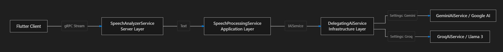
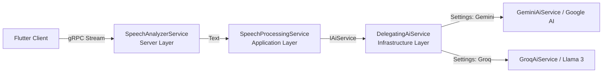

# SpeakMate

SpeakMate is a smart AI assistant application supporting voice commands and Speech-to-Text capabilities. This project brings together a **Flutter** (Mobile Client) and **.NET 10 gRPC** (Server) architecture in a unified monorepo.

## Architecture & Folder Structure

The project is structured as a Monorepo:

- **`src/SpeakMate.Client/`**
  - The mobile frontend built with Flutter. It records audio and streams the voice data (or transcribed text) to the server via gRPC.
- **`src/SpeakMate.Contracts/`**
  - The shared library that contains the `speech_analysis.proto` file and related C#/.NET helper classes. It defines the communication schema between the Flutter Client and the .NET Server.
- **`src/SpeakMate.Server/`**
  - A high-performance, gRPC-powered .NET 10 backend application. It receives audio streams from the Flutter client, processes them via an AI engine (Mock or real integrations like OpenAI), and streams the results back to the client.
- **`tests/`**
  - Contains xUnit test projects to ensure the backend logic works correctly.

### Request Flow (Clean Architecture & AI Strategy Pattern)

When a voice command or text is streamed from the mobile client, it flows through the layers cleanly adhering to **Clean Architecture** and **Strategy Pattern**:





- **Server Layer (`SpeechAnalyzerService`)**: Handles bi-directional gRPC streaming and authentication.
- **Application Layer (`SpeechProcessingService`)**: Orchestrates business use cases without depending on concrete infrastructure classes.
- **Infrastructure Layer (`DelegatingAiService`)**: Acts as a dynamic router/strategy resolver (`Strategy Pattern`) that delegates calls to the configured AI provider (`Gemini`, `Groq`, or `Mock`).

## Getting Started

### 1. Running the Server (Backend)
The backend runs on .NET 10.
```bash
# Navigate to the backend folder or run the solution from the root
dotnet run --project src/SpeakMate.Server/SpeakMate.Server.csproj
```
*(The server will typically start on a default port like `localhost:5001` or `localhost:5000`.)*

### 2. Running the Client (Flutter)
Before running the Flutter app, ensure you install all dependencies.
*Note: If you make changes to the `.proto` files in the future, you will need to regenerate the Dart gRPC code using the `protoc` tool.*
```bash
cd src/SpeakMate.Client
flutter pub get
flutter run
```

## Technologies Used
- **Frontend:** Dart, Flutter, `speech_to_text`, `grpc`, `protobuf`
- **Backend:** C#, .NET 10, gRPC (`Grpc.AspNetCore`)
- **Communication:** HTTP/2 (gRPC) & Protocol Buffers
- **AI / LLM Integration:** Google Gemini API (`gemini-2.5-flash`), Groq API (`llama-3.3-70b-versatile`)

## Configuring Free AI Providers & Keeping API Keys Safe

SpeakMate supports completely **Free AI Providers** without exposing keys in public repositories:

1. **Google Gemini API (Free Tier):**
   - Get your free API key at [Google AI Studio](https://aistudio.google.com/).
2. **Groq API (Free Tier - Ultra Fast Llama 3):**
   - Get your free API key at [GroqCloud](https://console.groq.com/).

### How to set the API Key securely (Do NOT commit keys to git):

Choose one of the following local setup methods:

#### Method A: Using .NET User Secrets (Recommended for Local Dev)
Navigate to the server project folder and set the key for each provider you want to use:
```bash
cd src/SpeakMate.Server
dotnet user-secrets init
dotnet user-secrets set "AiSettings:ActiveProvider" "Gemini" # Or "Groq"
dotnet user-secrets set "AiSettings:Providers:Gemini:ApiKey" "YOUR_GEMINI_API_KEY_HERE"
dotnet user-secrets set "AiSettings:Providers:Groq:ApiKey" "YOUR_GROQ_API_KEY_HERE"
```

#### Method B: Using Environment Variables
```bash
# Windows PowerShell
$env:AiSettings__ActiveProvider="Gemini"
$env:AiSettings__Providers__Gemini__ApiKey="YOUR_GEMINI_API_KEY_HERE"
$env:AiSettings__Providers__Groq__ApiKey="YOUR_GROQ_API_KEY_HERE"

# Linux / macOS
export AiSettings__ActiveProvider="Gemini"
export AiSettings__Providers__Gemini__ApiKey="YOUR_GEMINI_API_KEY_HERE"
export AiSettings__Providers__Groq__ApiKey="YOUR_GROQ_API_KEY_HERE"
```

#### Method C: Using `appsettings.Local.json` or `appsettings.Development.json`
Both `appsettings.Local.json` and `appsettings.Development.json` are listed in `.gitignore` to prevent leaking keys on GitHub.
